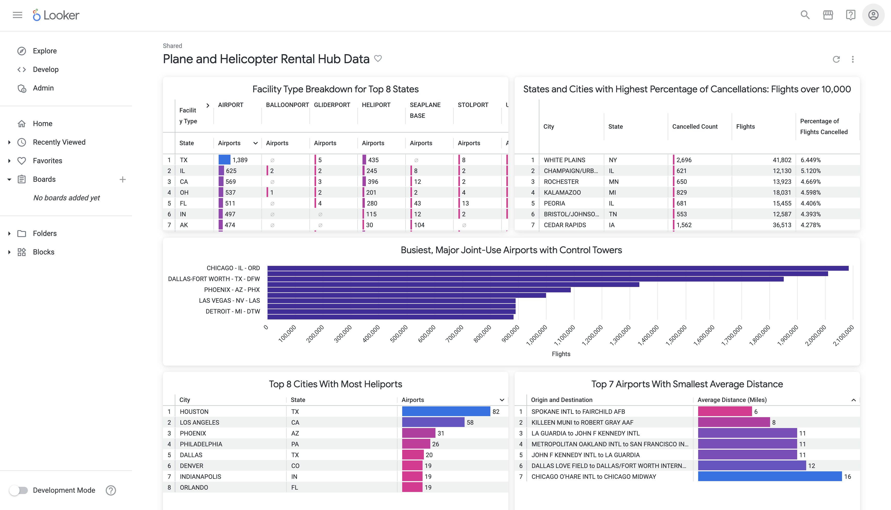
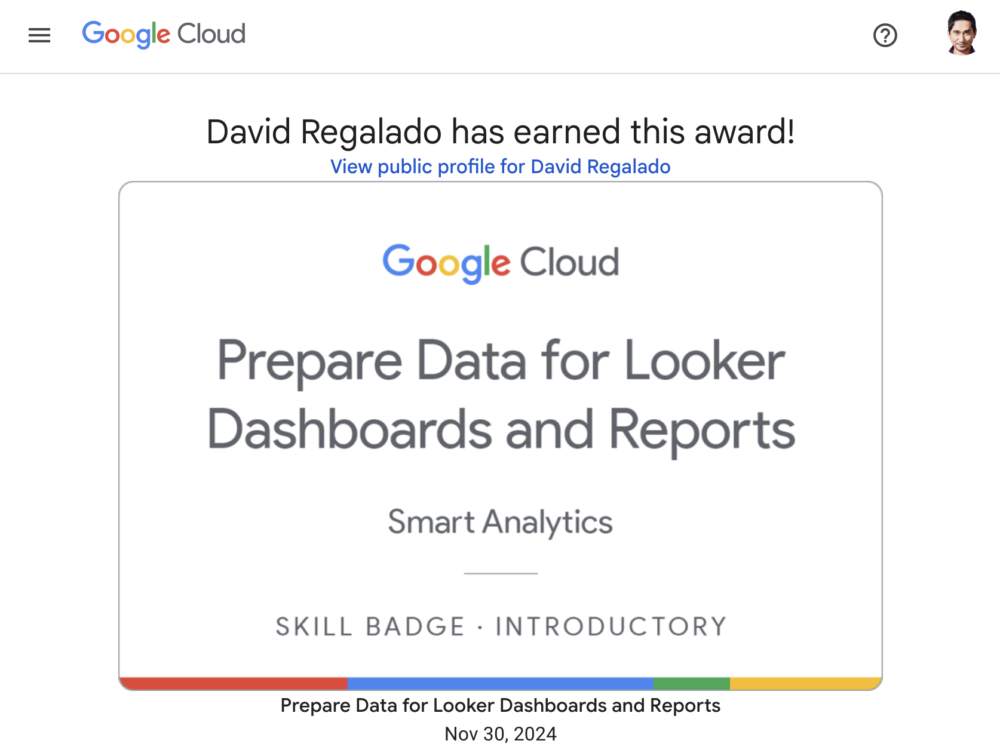

# Plane and Helicopter Rental Hub Data

## 🎯 The Goal
You are a data analyst intern for a private plane and helicopter rental company. For your first assignment, your new manager has tasked you with creating multiple dashboards to present at a company meeting. Specifically, you are required to use the provided FAA datasets to determine the best locations to set up new rental hubs.

Your manager wants the answer to the following questions:

- Which states and cities have the most airports with heliports?
- What is the facility type breakdown for the states with the most airports?
- What are the airports and states with the highest percentage of flight cancellations with over 10,000 flights?
- Where are the busiest, joint-use major airports that have control towers and what are their associated codes?
- What are the origin and destination airports with the smallest average distance between them?

I'll add more business questions after having an understanding of the underlying data model.

## 📊 The Dashboard - Looker

## 🤷🏻 The Data Model
Coming soon.

## 🧑🏻‍🏫 The Process
<a href="sql">sql queries</a>

## 👉 Can I get a badge?

Complete the introductory–and free–<a href="https://www.cloudskillsboost.google/course_templates/628">Prepare Data for Looker Dashboards and Reports</a> skill badge to demonstrate skills in the following: filtering, sorting, and pivoting data; merging results from different Looker Explores; and using functions and operators to build Looker dashboards and reports for data analysis and visualization.

A skill badge is an exclusive digital badge issued by Google Cloud in recognition of your proficiency with Google Cloud products and services and tests your ability to apply your knowledge in an interactive hands-on environment. Complete this skill badge course and the final assessment challenge lab to receive a skill badge that you can share with your network.

## 🥇 Earn your next skill badge

Completing this skill badge earns you the badge above, to recognize your achievement. Share your badge on your resume and social platforms, and announce your accomplishment using #GoogleCloudBadge.

This skill badge is part of <a href="https://www.cloudskillsboost.google/paths/18">Google Cloud’s Data Analyst learning path</a>.

## What now?

If you made it this far, follow <a href="https://beacons.ai/davidregalado">David Regalado</a> for more code!
